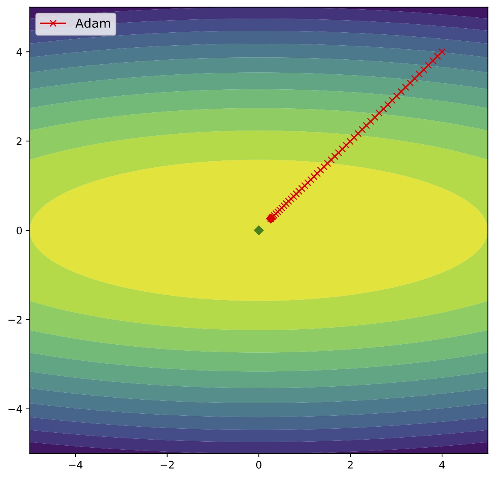
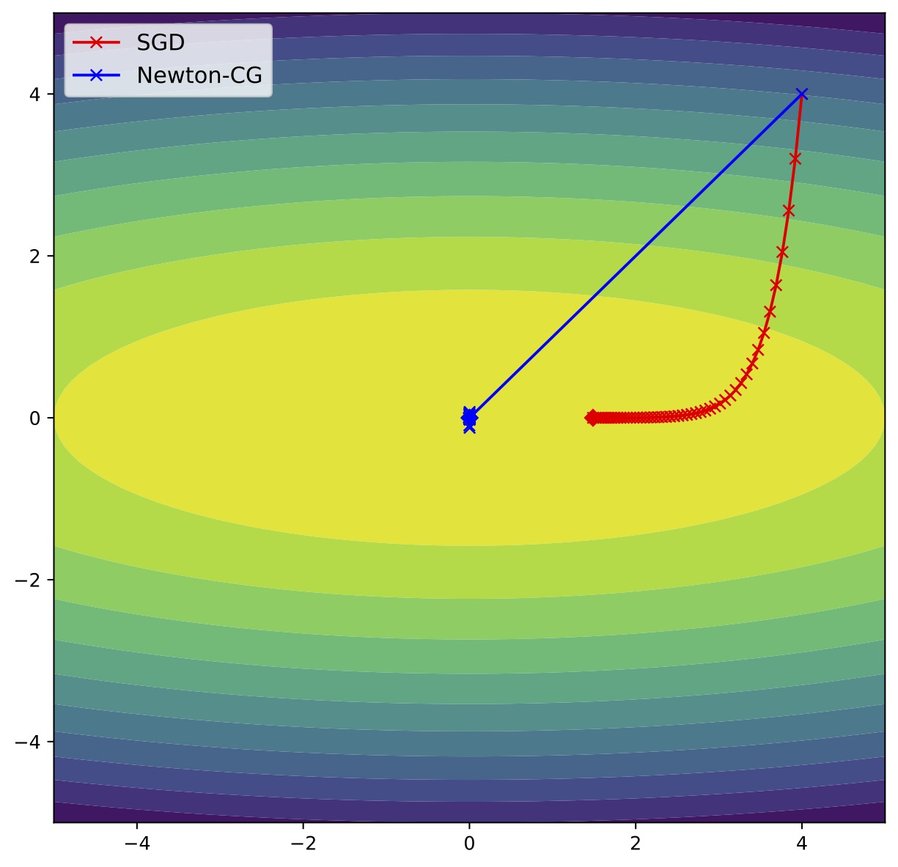
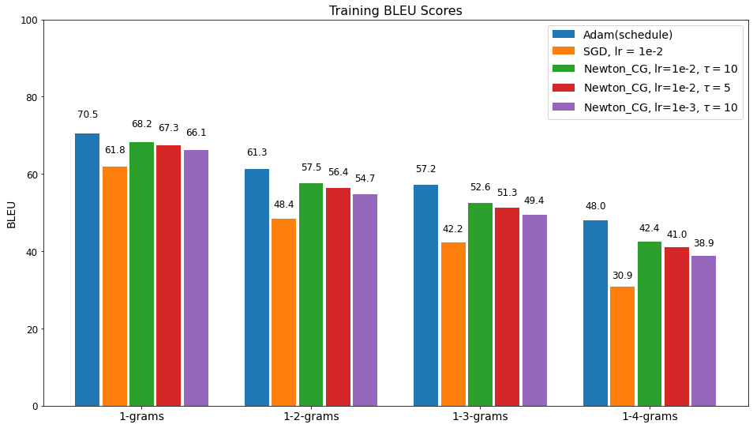
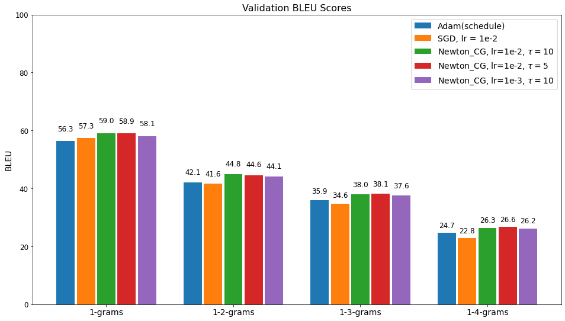

<p align="center">
    <!-- <a href="https://circleci.com/gh/huggingface/transformers"> -->
        
    </a>
    <!-- <a href="https://github.com/huggingface/transformers/blob/master/LICENSE"> -->
        
    </a>
    <!-- <a href="https://github.com/huggingface/transformers/blob/master/LICENSE"> -->
        
    </a>

</p>

# Introduction

This repo contains all codes of my master thesis
[Second Order training for Natural Language Processing using Newton-CG Optimizer](https://mediatum.ub.tum.de/1633374)

- preprocessing directory contains **raw text processing**, **tokenization**, **word embedding**, etc.
- nmt directory contains the training and evaluation processes of **Neural Machine Translation (NMT)** using **Transformer architecture**.
- plot directory contains the **loss and accuracy plot** in both training and evaluation. Also, the **BLUE** score bar chart is included.
- blue directory contains the calculation of **BLUE** score.

# Abstract

This thesis presents a **second-order optimizer** called **Newton-CG** to solve a **Portuguese to English Neural Machine Translation (NMT) task**
on the most dominant NMT model, **Transformer**. We mainly focus on comparing the performance between Newton-CG and two popular first-order optimizers,
Adam and Stochastic gradient descent(SGD). In our previous research, the Newton-CG has already gained speed-up and accuracy in image classification.
Besides, Newton-CG has shown **higher accuracy** than other first-order optimizers in senti- ment analysis on the Attention model.
In this NMT task, Newton-CG with pre-training **outperforms** others in BLEU scores and **overcomes the overfitting**.

<p align = "center">


</p>
<p align = "center">
    The trajectory of Newton-CG, SGD and Adam on a simple 2D quadratic function
</p>

# Results of Neural Machine Translation (NMT) in BLEU scores

<p align="center">
  
  
</p>

# Prerequisite addtional packages

1. `TensorFlow 1.15`. (The `newton_cg` so far doesn't support `TensorFlow 2.x`)
2. `newton_cg`. Please check the [original repo](https://github.com/severin617/Newton-CG) by Severin Reiz for details.
   ```sh
   $ pip install git+https://github.com/severin617/Newton-CG.git
   ```
3. `gast 0.2.2`
   ```sh
   $ pip install gast==0.2.2
   ```

# Citation

Here is my [master thesis](https://mediatum.ub.tum.de/1633374). Feel free to take a look and cite it :smiley:

```bibtex
@mastersthesis{ ,
	type = {Masterarbeit},
	author = {Yi-Han Hsieh},
	title = {Second Order training for Natural Language Processing using Newton-CG Optimizer},
	year = {2021},
	school = {Technical University of Munich},
	month = {Oct},
}
```

# Related researches

1. **[Application of second-order optimisation for large-scale deep learning](https://mediatum.ub.tum.de/1554836)**, by Julian Suk.
2. **[Training Deep Convolutional Neural Networks on the GPU Using a Second-Order Optimizer](https://mediatum.ub.tum.de/1554837)**, by Mihai Zorca.
3. **[Extending a Newton-CG Second-order Optimizer to Natural Language Processing](https://mediatum.ub.tum.de/1633373)**, by Tao Xiang.
