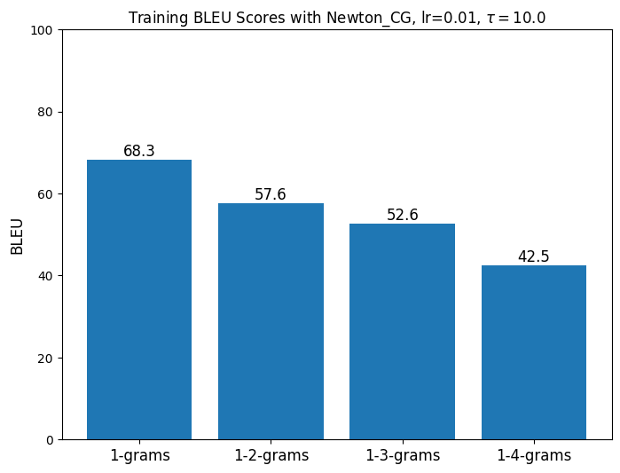
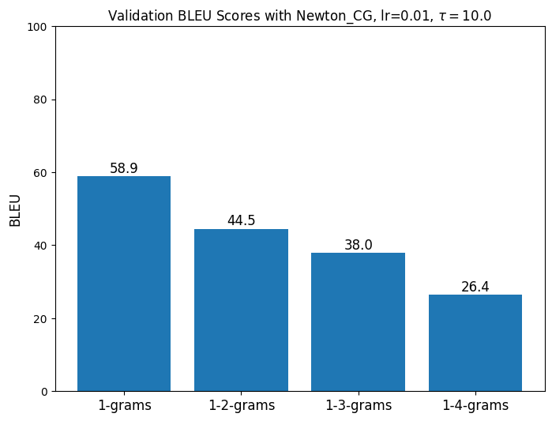

`prediction.py` translates the source language to the target language.

`prediction.py` can only translate one model with one optimizer at a time.

### How to use

1. Set the model hyperparameters in `model_config.json`
   ```json
     "MODEL_HYPERPARAMETERS":
         {"num_layers": 2, "num_heads": 10, "dropout_rate": 0.1, "dff": 256, "pe_inp": 1000, "pe_tar": 1000}
   ```
2. Run the `prediction.py` with optimizer argument

   ```sh
   python prediction.py Newton_CG_lr0.01_tau10.0
   ```

   results:

   ```sh
   Training data
   pred      ['surgery', 'was', 'a', 'success']
   ref       ['the', 'surgery', 'was', 'successful']
   --------------------------------------------------
   Validation data
   pred      ['they', 'had', 'UNK', 'fish', 'with', 'UNK', 'UNK']
   ref       ['did', 'they', 'eat', 'fish', 'and', 'chips']
   ```

`bleu.py` calculates the BLUE scores of the given model and optimizer.

### How to use

1. `data/[model]/[optimizer]` directory must contain corresponding `xxx_text_xx.txt` files
2. Run the `bleu.py` with model, optimizer and types('tr' or 'val') arguments

   ```sh
    python bleu.py samples35644_2layers_10heads_256dff Newton_CG_lr0.01_tau10.0 tr
   ```

   <p align="center">
     
     
   </p>

All saved data are stored in `data` directory.
