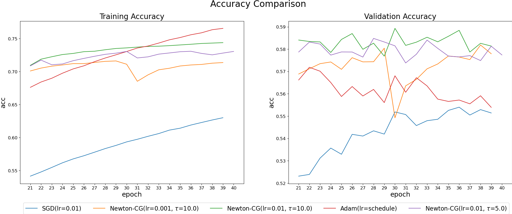
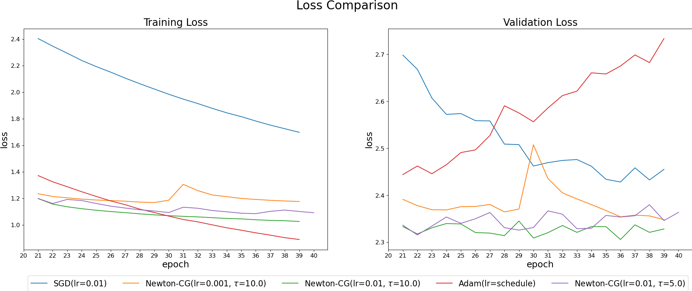

`plot.py` outputs the loss and accuracy plot of the given model
for comparing the performance of optimizers.

### How to use

Run the `plot.py` with the `model_name` argument.

```sh
$ python plot.py samples35644_2layers_10heads_256dff
```

`plot.py` will load the corresponding Logfiles from the `nmt/checkpoints/model_name` directory.

<p align="center">
  
  
</p>
